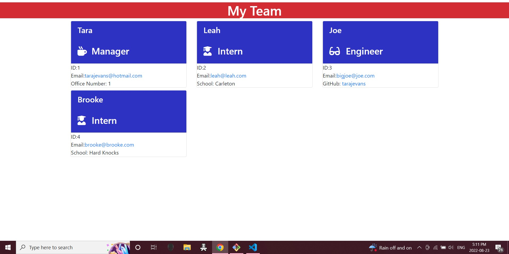

# employee-generator

This application allows the user to input new employee information and publishes this information to employee cards.

You need to install node.js and npm inquirer to run this application.

Live Deployed Link: https://tarajevans.github.io/employee-generator/

Repository: https://github.com/tarajevans/employee-generator

Video Walkthru: https://drive.google.com/file/d/1BGRaDoSTrX4y1TKro1TaJOzUrFNTVSm9/view

